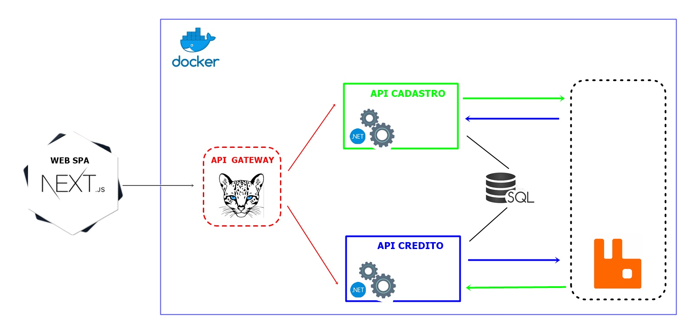

> ### O repositório contém uma aplicação distribuída em serviços e orquestrada com docker-compose.

* .Net Core 6
* ASP.Net Core
* Clean Architeture
* DDD
* SQL Server
* Entity Framework
* FluentValidation
* Ocelot
* RabbitMq

> ### Microserviço:
Microserviços é uma abordagem arquitetural para o desenvolvimento de software, onde uma aplicação é dividida em componentes pequenos e independentes, chamados microserviços, que são responsáveis por funções específicas. Cada microserviço é executado em seu próprio processo e pode ser desenvolvido, implantado e dimensionado de forma independente.

> ### Gateway: 
Um Gateway em microserviços é um componente que atua como ponto de entrada único para os clientes, redirecionando e roteando solicitações para os microserviços, nesse caso, foi utilizado Ocelot.
Dentre as principais utilidades de um Gateway são: Roteamento, Agregação de dados, Segurança, Monitoramento, Cache e também pode implementar estratégias de tolerância a falhas, como circuit breakers ou retries, para lidar com falhas nos microserviços

> ### RabbitMQ: 
O RabbitMQ é um sistema de mensageria, nesse caso, ele atua como um intermediário entre os serviços de cadastro e credito, permitindo a troca de mensagens assíncronas entre eles.

